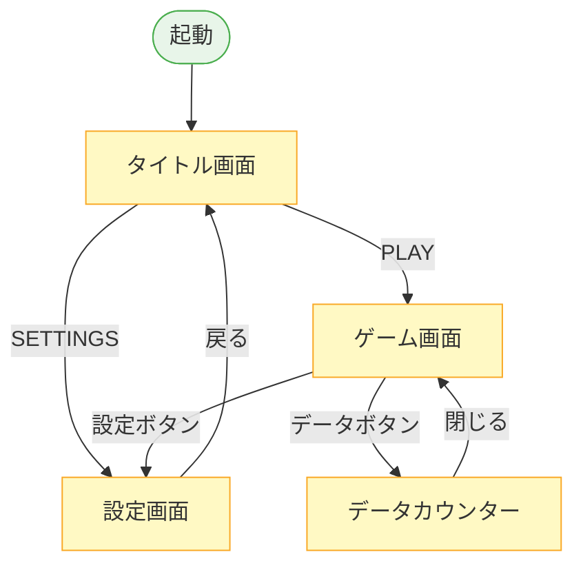
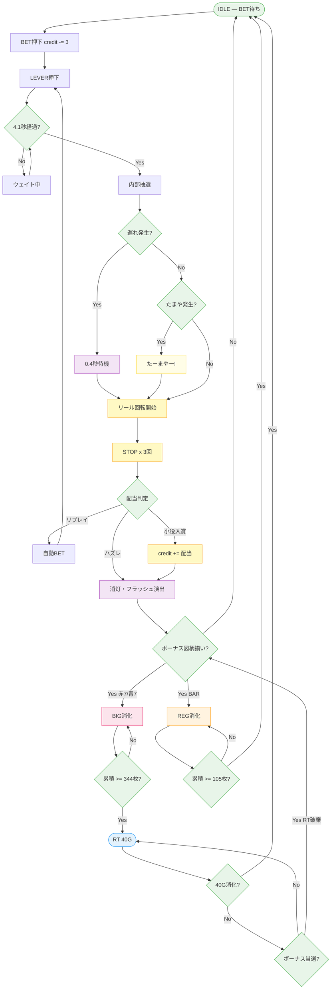
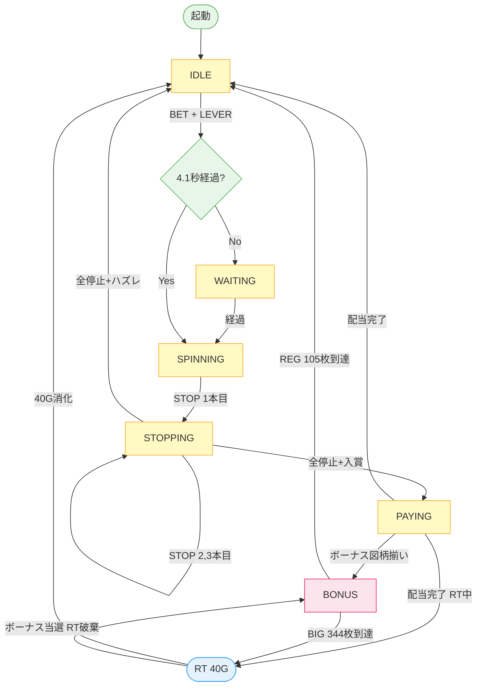

# NEON FLORA フロー図

## 1. 画面遷移図

```mermaid
flowchart TD
    A([起動]) --> B[タイトル画面]
    B -->|PLAY| C[ゲーム画面]
    B -->|SETTINGS| D[設定画面]
    D -->|戻る| B
    C -->|設定ボタン| D
    C -->|データボタン| E[データカウンター]
    E -->|閉じる| C

    style A fill:#e8f5e9,stroke:#4caf50,color:#333
    style B fill:#fff9c4,stroke:#f9a825,color:#333
    style C fill:#fff9c4,stroke:#f9a825,color:#333
    style D fill:#fff9c4,stroke:#f9a825,color:#333
    style E fill:#fff9c4,stroke:#f9a825,color:#333
```

## 2. メインゲームループ

```mermaid
flowchart TD
    IDLE([IDLE — BET待ち]) --> BET[BET押下 credit -= 3]
    BET --> LEVER[LEVER押下]
    LEVER --> W{4.1秒経過?}
    W -->|No| WAIT[ウェイト中] --> W
    W -->|Yes| LOTTERY[内部抽選]
    LOTTERY --> DL{遅れ発生?}
    DL -->|Yes| DLW[0.4秒待機] --> SPIN
    DL -->|No| TM{たまや発生?}
    TM -->|Yes| TME[たーまやー!] --> SPIN
    TM -->|No| SPIN

    SPIN[リール回転開始] --> STOP[STOP x 3回]
    STOP --> JUDGE{配当判定}
    JUDGE -->|リプレイ| RPL[自動BET] --> LEVER
    JUDGE -->|小役入賞| PAY[credit += 配当]
    JUDGE -->|ハズレ| EFF

    PAY --> EFF[消灯・フラッシュ演出]
    EFF --> BC{ボーナス図柄揃い?}
    BC -->|No| IDLE
    BC -->|Yes 赤7/青7| BIG[BIG消化]
    BC -->|Yes BAR| REG[REG消化]

    BIG --> BIGC{累積 >= 344枚?}
    BIGC -->|No| BIG
    BIGC -->|Yes| RT

    REG --> REGC{累積 >= 105枚?}
    REGC -->|No| REG
    REGC -->|Yes| IDLE

    RT([RT 40G]) --> RTC{40G消化?}
    RTC -->|No| RTB{ボーナス当選?}
    RTB -->|No| RT
    RTB -->|Yes RT破棄| BC
    RTC -->|Yes| IDLE

    style IDLE fill:#e8f5e9,stroke:#4caf50,color:#333
    style SPIN fill:#fff9c4,stroke:#f9a825,color:#333
    style BIG fill:#fce4ec,stroke:#e91e63,color:#333
    style REG fill:#fff3e0,stroke:#ff9800,color:#333
    style RT fill:#e3f2fd,stroke:#2196f3,color:#333
    style STOP fill:#fff9c4,stroke:#f9a825,color:#333
    style PAY fill:#fff9c4,stroke:#f9a825,color:#333
    style EFF fill:#f3e5f5,stroke:#9c27b0,color:#333
    style TME fill:#fffde7,stroke:#fdd835,color:#333
    style DLW fill:#f3e5f5,stroke:#9c27b0,color:#333
    style W fill:#e8f5e9,stroke:#4caf50,color:#333
    style DL fill:#e8f5e9,stroke:#4caf50,color:#333
    style TM fill:#e8f5e9,stroke:#4caf50,color:#333
    style JUDGE fill:#e8f5e9,stroke:#4caf50,color:#333
    style BC fill:#e8f5e9,stroke:#4caf50,color:#333
    style BIGC fill:#e8f5e9,stroke:#4caf50,color:#333
    style REGC fill:#e8f5e9,stroke:#4caf50,color:#333
    style RTC fill:#e8f5e9,stroke:#4caf50,color:#333
    style RTB fill:#e8f5e9,stroke:#4caf50,color:#333
```

## 3. 状態遷移図 (GameState)

```mermaid
flowchart TD
    S([起動]) --> IDLE

    IDLE[IDLE] -->|BET + LEVER| W{4.1秒経過?}
    W -->|No| WAITING[WAITING]
    WAITING -->|経過| SPINNING
    W -->|Yes| SPINNING[SPINNING]

    SPINNING -->|STOP 1本目| STOPPING[STOPPING]
    STOPPING -->|STOP 2,3本目| STOPPING

    STOPPING -->|全停止+入賞| PAYING[PAYING]
    STOPPING -->|全停止+ハズレ| IDLE

    PAYING -->|配当完了| IDLE
    PAYING -->|ボーナス図柄揃い| BONUS
    PAYING -->|配当完了 RT中| RT

    BONUS[BONUS] -->|BIG 344枚到達| RT
    BONUS -->|REG 105枚到達| IDLE

    RT([RT 40G]) -->|40G消化| IDLE
    RT -->|ボーナス当選 RT破棄| BONUS

    style S fill:#e8f5e9,stroke:#4caf50,color:#333
    style IDLE fill:#fff9c4,stroke:#f9a825,color:#333
    style WAITING fill:#fff9c4,stroke:#f9a825,color:#333
    style SPINNING fill:#fff9c4,stroke:#f9a825,color:#333
    style STOPPING fill:#fff9c4,stroke:#f9a825,color:#333
    style PAYING fill:#fff9c4,stroke:#f9a825,color:#333
    style BONUS fill:#fce4ec,stroke:#e91e63,color:#333
    style RT fill:#e3f2fd,stroke:#2196f3,color:#333
    style W fill:#e8f5e9,stroke:#4caf50,color:#333
```
