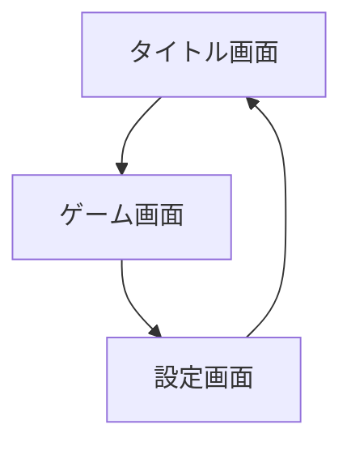
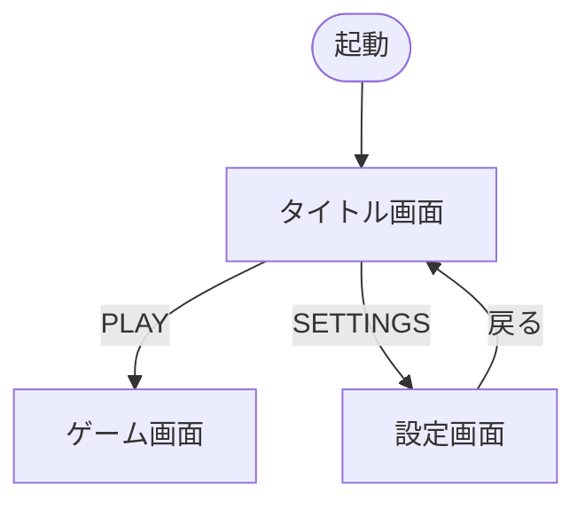

# Mermaid テスト

## テスト1: 最小フロー

```mermaid
flowchart TD
    A[タイトル画面] --> B[ゲーム画面]
    B --> C[設定画面]
    C --> A
```

## テスト2: 分岐あり

```mermaid
flowchart TD
    A([起動]) --> B[タイトル画面]
    B -->|PLAY| C[ゲーム画面]
    B -->|SETTINGS| D[設定画面]
    D -->|戻る| B
```
